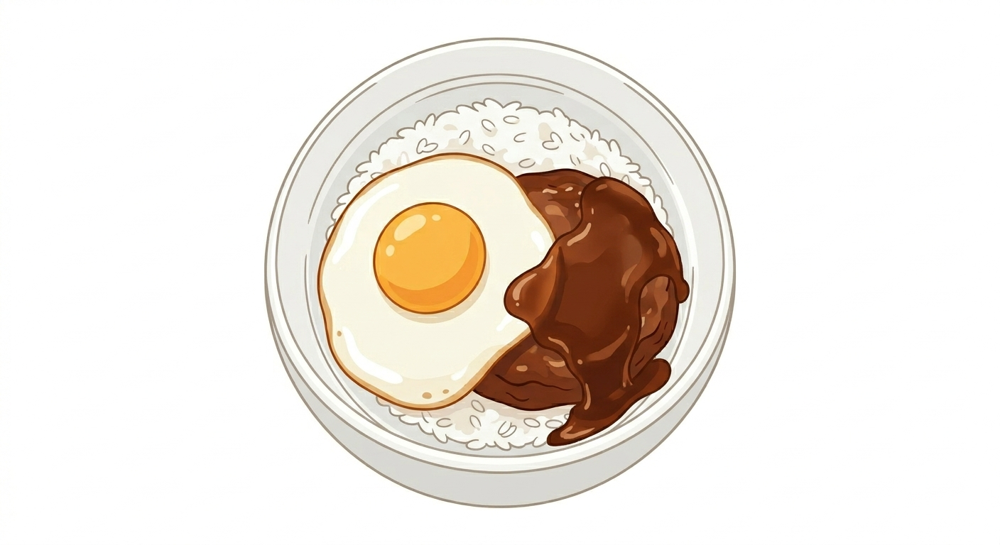

ここには普通の文章を書きます。今日はAstroの勉強をしています！

# 重要※mdは記号の後に半角スペースが必要
文章の前に#を付けるとh1と同じ意味になる。
### #の数を増やすとh6に近づいて文字が小さくなる

- ついに自分のPCでブログが動いた！
- Markdownの書き方をマスターした
- エラーが出ても怖くなくなった

文字の前に(-)を入れると箇条書きリストになる  
文字の前に-を付けるとhtmlでいう\<ul>の\<li>の書き方

## これからやりたいこと
1. ブログのデザインを可愛くする
2. スマホで撮影した**画像**を表示させてみる
3. 友達に自慢する（笑）

文字の前に(数字.)を入れると数字付きリストになる  
htmlでいう\<ol>の\<li>の書き方

## 改行
マークダウンで改行するには
- 文章の最後に半角スペースを２つ入れることで文章が改行される
- 文章の最後に\ を入れる 
- 文章と文章の間に改行を入れる

## テーブルの挿入
| KANI   | UNI      | サーモン |
| ------ | -------- | -------- |
| イクラ | マグロ   | たまご   |
| カニ   | ラーメン | からあげ |

## テキストのカラー設定 

- マークダウンでは色を変える方法がない
- そのためHTMLの記載方法を使い色を変更する
- \文章\ 

## 画像

\![画像説明]\(img/caree.png(画像ファイルの場所))

## javascript

javascriptのデモ 
mdファイルの中にhtmlの形式で\

